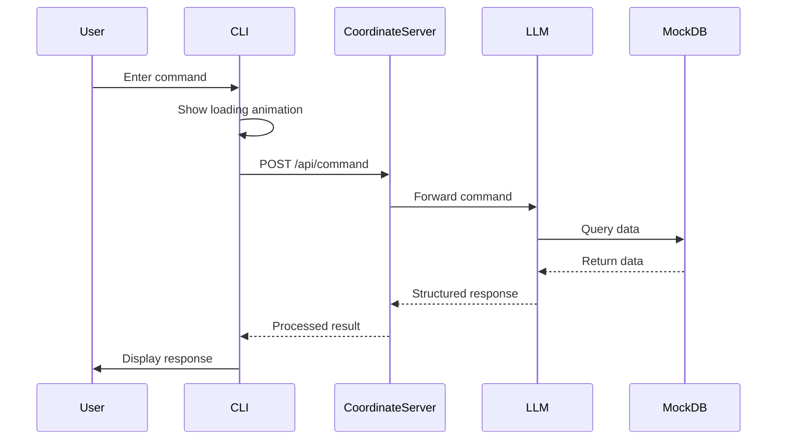

# Local-LM Proxy

A modular and lightweight FastAPI-based proxy for serving OpenAI-compatible `/v1/chat/completions` requests to a locally hosted or third-party Large Language Model (LLM) backend. Designed to facilitate integration, model switching, and prompt management without altering core logic.

## Overview

This project enables:

- Local testing of small language models (SLMs) via an OpenAI-compatible API
- Seamless switching between local, Grok, or OpenAI endpoints
- Custom system prompts in multiple languages
- Simple, transparent configuration and dependency structure

## Features

- OpenAI-compatible `/v1/chat/completions` proxy
- Centralized configuration via `config/configure.json`
- Multi-language and task-specific prompts via `config/system-prompt.json`
- Clean separation between interface, logic, and configuration
- Lightweight and self-contained (no external databases or queues)

## Project Structure

```
slm-toolkits/
├── app/
│   ├── main.py            # FastAPI app with core routing and logic
│   └── settings.py        # Configuration loader and cache
├── config/
│   ├── configure.json     # LLM provider and parameters
│   └── system-prompt.json # Task-specific and language-based system prompts
├── requirements.txt       # Python dependencies
├── .gitignore             # Common exclusions
└── README.md              # Project documentation
```

## Configuration

### `config/configure.json`

Defines the upstream LLM service and related parameters:

```json
{
  "lm_api_url": "http://localhost:1234/v1/chat/completions",
  "provider": "local",
  "api_key": "",
  "model": "grok-3-mini-beta",
  "request_options": {
    "temperature": 0.7,
    "max_tokens": 1024,
    "stream": false
  }
}
```

### `config/system-prompt.json`

Defines reusable system prompts for different roles or tasks. Example:

```json
{
  "default": "You are a helpful assistant.",
  "zh-TW": "你是一個有幫助且專業的助理。",
  "ja": "あなたは有能で専門的なアシスタントです。",
  "drone-task": "You are a task-oriented assistant in a smart drone-based solar panel maintenance system..."
}
```

## Getting Started

```bash
# Step 1: Create virtual environment
python -m venv .venv
source .venv/bin/activate     # On Windows: .venv\Scripts\activate

# Step 2: Install dependencies
pip install -r requirements.txt

# Step 3: Modify configuration for your target LLM
nano config/configure.json

# Step 4: Launch the API server
uvicorn app.main:app --reload --port 8000
```

## API Usage

### Endpoint

```
POST /v1/chat/completions
```

### Request Format

```json
{
  "messages": [
    { "role": "system", "content": "You are a helpful assistant." },
    { "role": "user", "content": "Hello, who are you?" }
  ],
  "stream": false
}
```

### Response Format

```json
{
  "id": "...",
  "object": "chat.completion",
  "created": 1714413517,
  "choices": [
    {
      "index": 0,
      "message": {
        "role": "assistant",
        "content": "Hello! I'm your assistant."
      },
      "finish_reason": "stop"
    }
  ],
  "usage": {
    "prompt_tokens": 18,
    "completion_tokens": 10,
    "total_tokens": 28
  },
  "proxy_request_id": "abc123-...",
  "latency_ms": 215.7
}
```

## Customization

To use a different system prompt, inject it into the first `system` message or create a dedicated endpoint using the value from `system-prompt.json`.

Example:

```python
from app.settings import get_settings
settings = get_settings()
prompt = settings.prompts["drone-task"]
```

## TODO:

- [ ] Add a test-coordinator to test the toolkit
- [ ] Finish the prompt benchmark dataset and put it in to ./slm-toolkits/prompt-benchmark/
- [ ] Finish the auto prompt benchmark script

## License

This project is licensed under the MIT License.

# Solar Panel Maintenance System Mockup

## System Architecture



## Components

### 1. Mock CLI (`mock-up-cli.py`)

- Interactive command-line interface
- Features:
  - Loading animation during API calls
  - Error handling
  - Clean response formatting
  - Easy-to-use command input

### 2. Coordinate Server (`mock-up-coordinate-server.py`)

- Flask-based API server
- Features:
  - LLM integration
  - Mock database management
  - Tool simulation
  - Response formatting

### 3. Mock Database

- In-memory data storage
- Contains:
  - Drone information
  - Panel clusters
  - Maintenance history
  - Status tracking

## Usage Instructions

1. Start the Coordinate Server:

```bash
python mockup/mock-up-coordinate-server.py
```

2. Start the CLI:

```bash
python mockup/mock-up-cli.py
```

3. Available Commands:

- Query panel status: "Check status of panel P-001"
- Request cleaning: "Clean panel P-002"
- Request inspection: "Inspect panel P-003"
- Exit: Type 'quit' or 'exit'

## Test Results

### 1. Panel Status Queries

- Successfully retrieves panel status
- Shows maintenance history
- Displays location information

### 2. Cleaning Requests

- Validates cleaning requirements
- Checks 7-day cleaning interval
- Assigns available drones

### 3. Inspection Requests

- Validates inspection requirements
- Checks 24-hour inspection interval
- Provides detailed inspection results

### 4. Error Handling

- Handles invalid panel IDs
- Manages unavailable drones
- Processes network errors
- Shows appropriate error messages

## Data Structure

### Drone Data

```json
{
  "drone_id": 1,
  "position": { "latitude": 0.0, "longitude": 0.0 },
  "message_time": "2025-05-15T09:00:00Z",
  "heading": 0.0,
  "battery": 100.0,
  "destination": { "latitude": 10.0, "longitude": 10.0 },
  "status": "available"
}
```

### Panel Data

```json
{
  "panel_id": "P-001",
  "status": "clean",
  "latest_status_time": "2025-05-15T09:00:00Z",
  "most_recent_repair": "2025-04-30T13:45:00Z",
  "offset": { "x": -2, "y": 2 },
  "history": [
    { "type": "repair", "date": "2025-04-30", "action": "replaced connector" },
    { "type": "inspection", "date": "2025-05-10", "result": "normal" }
  ]
}
```

## Current Limitations

1. Mock Implementation

   - Uses in-memory database
   - Simulated LLM responses
   - Limited error scenarios

2. Response Time

   - Depends on LLM processing
   - Network latency
   - Tool simulation delay

3. Data Persistence
   - No permanent storage
   - Data resets on server restart
   - Limited history tracking

## Future Improvements

1. Planned Features

   - Real database integration
   - Enhanced error handling
   - More detailed status reporting
   - Task scheduling system

2. Performance Optimization

   - Response caching
   - Parallel processing
   - Connection pooling

3. User Experience
   - More interactive CLI
   - Better error messages
   - Progress tracking
   - Command history
