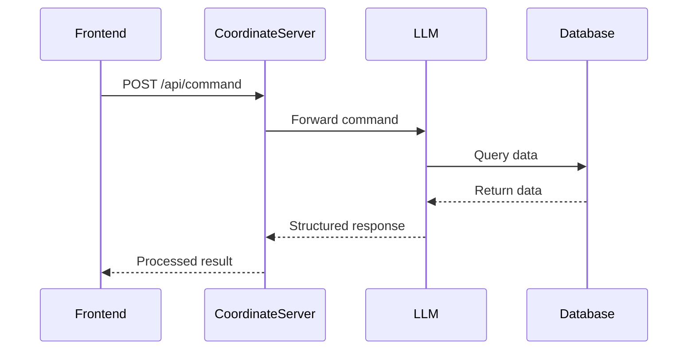

# Coordinate Server System Specification

## System Components Interaction (Conceptual Diagram)



## 1. LLM Command Types

### 1.1 Database Queries

#### Input Format

```json
{
  "tool": {
    "name": "db",
    "parameters": {
      "target": "panel|rover|drone",
      "query": "status|battery|position|history|current_operation|maintenance|condition",
      "id": "id|keywords|position"
    }
  }
}
```

#### Parameter Details

- `target`: Specifies the type of entity to query

  - `panel`: Solar panel information
  - `rover`: Ground maintenance vehicle information
  - `drone`: Aerial vehicle information

- `query`: Type of information to retrieve

  - `status`: Current operational status
  - `battery`: Battery level and charging status
  - `position`: Current coordinates
  - `history`: Maintenance and operation history
  - `current_operation`: Active task information
  - `maintenance`: Maintenance schedule and history
  - `condition`: Physical condition assessment

- `id`: Identifier for the target
  - Can be specific ID (e.g., "SP-001")
  - Keywords (e.g., "west", "north")
  - Position coordinates

#### Output Format

```json
{
  "status": "success",
  "data": {
    // Panel specific response
    "panel_status": "operational|maintenance|error",
    "last_maintenance": "2024-03-20T10:30:00Z",
    "condition": "good|fair|poor",
    "position": {
      "x": 123.45,
      "y": 67.89,
      "z": 10.0
    },
    "battery_level": 85,
    "efficiency": 95.5,
    "maintenance_history": [
      {
        "date": "2024-03-20T10:30:00Z",
        "type": "cleaning",
        "status": "completed"
      }
    ]
  },
  "timestamp": "2024-03-21T08:00:00Z"
}
```

#### Response Fields

- `panel_status`: Current operational state
- `last_maintenance`: Timestamp of last maintenance
- `condition`: Physical condition assessment
- `position`: 3D coordinates
- `battery_level`: Current battery percentage
- `efficiency`: Current energy conversion efficiency
- `maintenance_history`: Array of maintenance records

#### Error Response

```json
{
  "status": "error",
  "error": {
    "code": "DB_QUERY_ERROR",
    "message": "Failed to retrieve panel information",
    "details": {
      "reason": "Panel not found",
      "suggested_action": "Verify panel ID"
    }
  },
  "timestamp": "2024-03-21T08:00:00Z"
}
```

#### Common Error Codes

- `DB_QUERY_ERROR`: General database query failure
- `INVALID_TARGET`: Unsupported target type
- `INVALID_QUERY`: Unsupported query type
- `NOT_FOUND`: Target entity not found
- `DB_CONNECTION_ERROR`: Database connection failure

### 1.2 Task Assignment

#### Input Format

```json
{
    "tool": {
        "name": "assign",
        "parameters": {
            "drone_id": "string",
            "task": "string",
            "panel_id": "string",
            "position": {
                "x": number,
                "y": number,
                "z": number
            }
        }
    }
}
```

#### Parameter Details

- `drone_id`: Identifier of the drone to assign

  - Format: "D-XXX" where XXX is a unique number
  - Example: "D-001", "D-002"

- `task`: Type of task to assign

  - `clean`: Panel cleaning operation
  - `inspect`: Visual inspection
  - `maintenance`: General maintenance
  - `emergency`: Emergency response

- `panel_id`: Target panel identifier

  - Format: "SP-XXX" where XXX is a unique number
  - Example: "SP-001", "SP-002"

- `position`: 3D coordinates of the target
  - `x`: East-West position (meters)
  - `y`: North-South position (meters)
  - `z`: Altitude (meters)

#### Output Format

```json
{
  "status": "success",
  "task_id": "T-20240321-001",
  "assigned_to": "D-001",
  "task_type": "clean",
  "target": "SP-001",
  "estimated_completion": "2024-03-21T09:30:00Z",
  "priority": "normal|high|urgent",
  "status": "assigned|in_progress|completed|failed",
  "timestamp": "2024-03-21T08:00:00Z"
}
```

#### Response Fields

- `task_id`: Unique task identifier
- `assigned_to`: Drone identifier
- `task_type`: Type of assigned task
- `target`: Target panel identifier
- `estimated_completion`: Expected completion time
- `priority`: Task priority level
- `status`: Current task status

#### Error Response

```json
{
  "status": "error",
  "error": {
    "code": "ASSIGNMENT_ERROR",
    "message": "Failed to assign task",
    "details": {
      "reason": "Drone not available",
      "suggested_action": "Try different drone or wait"
    }
  },
  "timestamp": "2024-03-21T08:00:00Z"
}
```

#### Common Error Codes

- `ASSIGNMENT_ERROR`: General assignment failure
- `DRONE_UNAVAILABLE`: Drone is busy or offline
- `INVALID_TASK`: Unsupported task type
- `INVALID_POSITION`: Invalid coordinates
- `PANEL_NOT_FOUND`: Target panel not found

### 1.3 Task List Query

#### Input Format

```json
{
  "tool": {
    "name": "tasklist",
    "parameters": {
      "filter": {
        "status": "pending|in_progress|completed",
        "type": "clean|inspect|maintenance",
        "priority": "normal|high|urgent"
      },
      "time_range": {
        "start": "2024-03-21T00:00:00Z",
        "end": "2024-03-21T23:59:59Z"
      }
    }
  }
}
```

#### Parameter Details

- `filter`: Optional filtering criteria

  - `status`: Task status filter
  - `type`: Task type filter
  - `priority`: Priority level filter

- `time_range`: Optional time period
  - `start`: Start timestamp
  - `end`: End timestamp

#### Output Format

```json
{
  "status": "success",
  "data": {
    "tasks": [
      {
        "task_id": "T-20240321-001",
        "type": "clean",
        "assigned_to": "D-001",
        "target": "SP-001",
        "status": "in_progress",
        "priority": "normal",
        "start_time": "2024-03-21T08:00:00Z",
        "estimated_completion": "2024-03-21T09:30:00Z",
        "progress": 45
      }
    ],
    "summary": {
      "total": 10,
      "pending": 3,
      "in_progress": 5,
      "completed": 2,
      "failed": 0
    }
  },
  "timestamp": "2024-03-21T08:00:00Z"
}
```

#### Response Fields

- `tasks`: Array of task details

  - `task_id`: Unique task identifier
  - `type`: Task type
  - `assigned_to`: Assigned drone
  - `target`: Target panel
  - `status`: Current status
  - `priority`: Priority level
  - `start_time`: Task start time
  - `estimated_completion`: Expected completion
  - `progress`: Completion percentage

- `summary`: Task statistics
  - `total`: Total number of tasks
  - `pending`: Pending tasks
  - `in_progress`: Active tasks
  - `completed`: Completed tasks
  - `failed`: Failed tasks

#### Error Response

```json
{
  "status": "error",
  "error": {
    "code": "TASKLIST_ERROR",
    "message": "Failed to retrieve task list",
    "details": {
      "reason": "Invalid time range",
      "suggested_action": "Check time range parameters"
    }
  },
  "timestamp": "2024-03-21T08:00:00Z"
}
```

#### Common Error Codes

- `TASKLIST_ERROR`: General task list retrieval failure
- `INVALID_FILTER`: Invalid filter parameters
- `INVALID_TIME_RANGE`: Invalid time period
- `DB_CONNECTION_ERROR`: Database connection failure

## 2. LLM Response Processing

### 2.1 Database Query Response

```json
{
    "status": "success",
    "data": {
        "panel_status": "string",
        "last_maintenance": "timestamp",
        "condition": "string",
        "position": {
            "x": number,
            "y": number,
            "z": number
        }
    }
}
```

### 2.2 Task Assignment Response

```json
{
  "status": "success",
  "task_id": "string",
  "assigned_to": "string",
  "estimated_completion": "timestamp"
}
```

### 2.3 Error Response

```json
{
  "status": "error",
  "error": {
    "code": "string",
    "message": "string"
  }
}
```

## 3. Frontend API Specification

### 3.1 Command Endpoint

```
POST /api/chat
Content-Type: application/json
```

#### Request

```json
{
  "command": "string", // Natural language command from user
  "parameters": {
    "message": "string"
  },
  "chat_id": "string" //(optional, default is "-1")
}
```

#### Natural Language Processing

- Accepts natural language input from users
- Examples of valid commands:
  - "Check the status of panel SP-001"
  - "Clean the solar panels in the west section"
  - "What's the maintenance history of drone D-001?"
  - "Assign a drone to inspect panel SP-002"
- System will:
  1. Parse natural language input
  2. Identify intent and required actions
  3. Extract relevant parameters
  4. Generate structured command for LLM
  5. Return human-readable response

#### Response

```json
{
  "status": "success|error",
  "data": {
    // Response data
  },
  "timestamp": "ISO-8601",
  "message": "Human readable response message"
}
```

## 4. Data Flow Specification

### 4.1 LLM to Database Flow

1. LLM receives command
2. LLM determines required data
3. LLM queries database
4. Database returns data
5. LLM processes data
6. LLM generates structured response

### 4.2 Coordinate Server Processing

1. Receives command from frontend
2. Forwards to LLM
3. Receives LLM response
4. Processes response
5. Executes necessary actions
6. Returns result to frontend

## 5. Response Types

### 5.1 Success Response

```json
{
  "status": "success",
  "data": {
    // Operation specific data
  },
  "timestamp": "ISO-8601"
}
```

### 5.2 Error Response

```json
{
  "status": "error",
  "error": {
    "code": "string",
    "message": "string",
    "details": {}
  },
  "timestamp": "ISO-8601"
}
```

## 6. Command Processing Rules

### 6.1 Database Queries

- Must validate query parameters
- Must handle missing data gracefully
- Must return structured response
- Must include timestamp

### 6.2 Task Assignment

- Must validate task parameters
- Must check resource availability
- Must generate unique task ID
- Must return task status

### 6.3 Task List

- Must return current task status
- Must include resource allocation
- Must include estimated completion times
- Must include task priority

## 7. Error Handling

### 7.1 Database Errors

- Connection failures
- Query timeouts
- Data validation errors
- Missing data

### 7.2 Task Assignment Errors

- Resource unavailable
- Invalid parameters
- Task conflicts
- System overload

### 7.3 General Errors

- Invalid commands
- Authentication failures
- Rate limiting
- System errors
