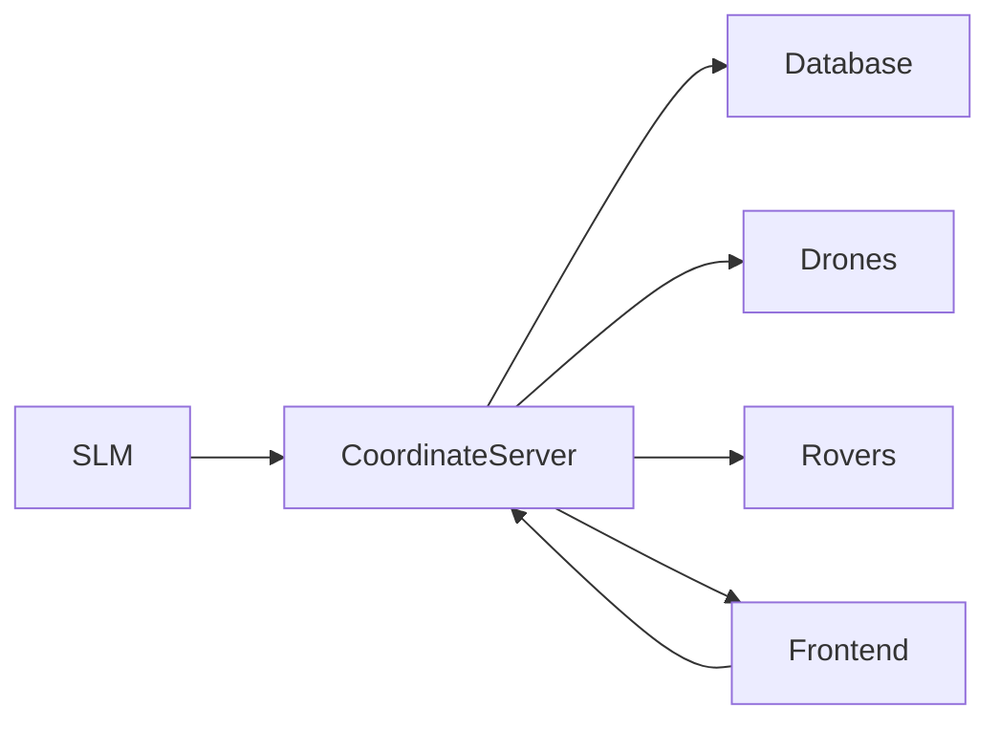

# Coordinate Server Technical Specification

## Overview

The Coordinate Server acts as a middleware between the LLM (Large Language Model) and the system's core components (Database, Drones, Rovers). It processes structured JSON commands from the LLM and executes corresponding actions.

## System Architecture



## API Endpoints

### 1. Command Processing Endpoint

```
POST /api/process-command
Content-Type: application/json
```

#### Request Body Structure

```json
{
    "reason": "string",
    "task": {
        "drone_id": "string",
        "action": "string",
        "panel_id": "string",
        "position": {
            "x": number,
            "y": number,
            "z": number
        }
    }
}
```

### 2. Database Query Endpoint

```
POST /api/db-query
Content-Type: application/json
```

#### Request Body Structure

```json
{
  "tool": {
    "name": "db",
    "parameters": {
      "target": "panel|rover|drone",
      "query": "status|battery|position|history|current_operation|maintenance|condition",
      "id": "string"
    }
  }
}
```

### 3. Task Assignment Endpoint

```
POST /api/assign-task
Content-Type: application/json
```

#### Request Body Structure

```json
{
    "tool": {
        "name": "assign",
        "parameters": {
            "drone_id": "string",
            "task": "string",
            "panel_id": "string",
            "position": {
                "x": number,
                "y": number,
                "z": number
            }
        }
    }
}
```

## Command Types

### 1. Database Operations

- **Panel Queries**

  - Status check
  - Condition assessment
  - Maintenance history
  - Position verification

- **Drone Queries**

  - Position tracking
  - Battery status
  - Current operation status

- **Rover Queries**
  - Position tracking
  - Battery status
  - Maintenance status

### 2. Task Assignment Operations

- **Drone Tasks**

  - Panel cleaning
  - Panel inspection
  - Condition checking
  - Emergency response

- **Rover Tasks**
  - Ground maintenance
  - Panel cleaning
  - Emergency response

## Response Format

### Success Response

```json
{
  "status": "success",
  "data": {
    // Response data specific to the operation
  },
  "timestamp": "ISO-8601 timestamp"
}
```

### Error Response

```json
{
  "status": "error",
  "error": {
    "code": "string",
    "message": "string",
    "details": {}
  },
  "timestamp": "ISO-8601 timestamp"
}
```

## Implementation Guidelines

### 1. Command Validation

- Validate all incoming commands against predefined schemas
- Ensure required parameters are present
- Verify data types and ranges
- Check for conflicting operations

### 2. Database Operations

- Implement connection pooling
- Use prepared statements
- Handle transaction management
- Implement retry mechanisms for failed queries

### 3. Task Management

- Maintain task queue
- Implement priority system
- Handle task conflicts
- Monitor task execution status

### 4. Error Handling

- Implement comprehensive error logging
- Provide detailed error messages
- Handle network failures
- Implement retry mechanisms

### 5. Security Considerations

- Implement API authentication
- Validate all incoming requests
- Sanitize database queries
- Implement rate limiting

## Performance Requirements

### Response Time

- Command processing: < 100ms
- Database queries: < 200ms
- Task assignment: < 150ms

### Throughput

- Support minimum 100 concurrent connections
- Handle minimum 1000 requests per minute

### Availability

- 99.9% uptime
- Maximum 1 minute recovery time

## Monitoring and Logging

### Metrics to Track

- Response times
- Error rates
- Queue lengths
- Resource utilization
- Task completion rates

### Logging Requirements

- All API requests and responses
- Error conditions
- System state changes
- Performance metrics

## Testing Requirements

### Unit Tests

- Command validation
- Database operations
- Task management
- Error handling

### Integration Tests

- End-to-end workflows
- Component interaction
- Error scenarios
- Performance benchmarks

### Load Tests

- Concurrent request handling
- Database performance
- Task queue management
- System recovery
