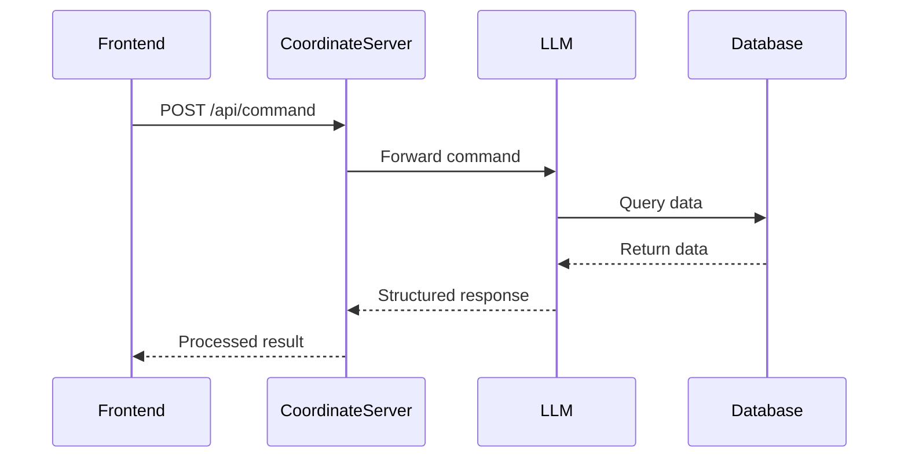

# Coordinate Server System Specification

## System Components Interaction



## 1. LLM Command Types

### 1.1 Database Queries

```json
{
  "tool": {
    "name": "db",
    "parameters": {
      "target": "panel|rover|drone",
      "query": "status|battery|position|history|current_operation|maintenance|condition",
      "id": "id|keywords|position"
    }
  }
}
```

### 1.2 Task Assignment

```json
{
    "tool": {
        "name": "assign",
        "parameters": {
            "drone_id": "string",
            "task": "string",
            "panel_id": "string",
            "position": {
                "x": number,
                "y": number,
                "z": number
            }
        }
    }
}
```

### 1.3 Task List Query

```json
{
  "tool": {
    "name": "tasklist",
    "parameters": {}
  }
}
```

## 2. LLM Response Processing

### 2.1 Database Query Response

```json
{
    "status": "success",
    "data": {
        "panel_status": "string",
        "last_maintenance": "timestamp",
        "condition": "string",
        "position": {
            "x": number,
            "y": number,
            "z": number
        }
    }
}
```

### 2.2 Task Assignment Response

```json
{
  "status": "success",
  "task_id": "string",
  "assigned_to": "string",
  "estimated_completion": "timestamp"
}
```

### 2.3 Error Response

```json
{
  "status": "error",
  "error": {
    "code": "string",
    "message": "string"
  }
}
```

## 3. Frontend API Specification

### 3.1 Command Endpoint

```
POST /api/chat
Content-Type: application/json
```

#### Request

```json
{
  "command": "string", // Natural language command from user
  "parameters": {
    "message": "string"
  },
  "chat_id": "string" //(optional, default is "-1")
}
```

#### Natural Language Processing

- Accepts natural language input from users
- Examples of valid commands:
  - "Check the status of panel SP-001"
  - "Clean the solar panels in the west section"
  - "What's the maintenance history of drone D-001?"
  - "Assign a drone to inspect panel SP-002"
- System will:
  1. Parse natural language input
  2. Identify intent and required actions
  3. Extract relevant parameters
  4. Generate structured command for LLM
  5. Return human-readable response

#### Response

```json
{
  "status": "success|error",
  "data": {
    // Response data
  },
  "timestamp": "ISO-8601",
  "message": "Human readable response message"
}
```

## 4. Data Flow Specification

### 4.1 LLM to Database Flow

1. LLM receives command
2. LLM determines required data
3. LLM queries database
4. Database returns data
5. LLM processes data
6. LLM generates structured response

### 4.2 Coordinate Server Processing

1. Receives command from frontend
2. Forwards to LLM
3. Receives LLM response
4. Processes response
5. Executes necessary actions
6. Returns result to frontend

## 5. Response Types

### 5.1 Success Response

```json
{
  "status": "success",
  "data": {
    // Operation specific data
  },
  "timestamp": "ISO-8601"
}
```

### 5.2 Error Response

```json
{
  "status": "error",
  "error": {
    "code": "string",
    "message": "string",
    "details": {}
  },
  "timestamp": "ISO-8601"
}
```

## 6. Command Processing Rules

### 6.1 Database Queries

- Must validate query parameters
- Must handle missing data gracefully
- Must return structured response
- Must include timestamp

### 6.2 Task Assignment

- Must validate task parameters
- Must check resource availability
- Must generate unique task ID
- Must return task status

### 6.3 Task List

- Must return current task status
- Must include resource allocation
- Must include estimated completion times
- Must include task priority

## 7. Error Handling

### 7.1 Database Errors

- Connection failures
- Query timeouts
- Data validation errors
- Missing data

### 7.2 Task Assignment Errors

- Resource unavailable
- Invalid parameters
- Task conflicts
- System overload

### 7.3 General Errors

- Invalid commands
- Authentication failures
- Rate limiting
- System errors
